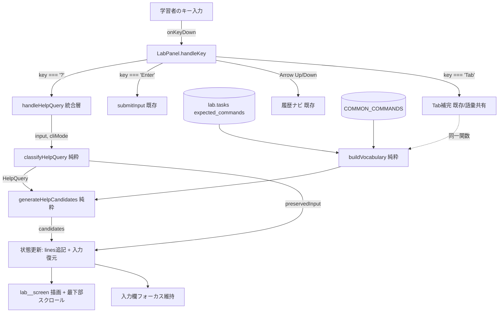

# Design Document

## Overview

本設計は、ラボ練習モードのターミナル（`src/components/LabPanel.tsx`）に Cisco IOS 風の `?` コンテキスト依存ヘルプを追加する。学習者が入力途中で `?` を打つと、現在の CLI モードで利用可能なコマンド／キーワード候補を画面に表示し、`?` を除いた入力を保持したまま操作を継続できるようにする。

現状、Tab 補完のロジック（`COMMON_COMMANDS` の定義、`expected_commands` との結合、単語分解、値トークン除外、語彙集合の構築）は `LabPanel.tsx` の `handleKey` の中にインラインで書かれている。ヘルプ機能はこの語彙構築ロジックと**完全に同一の結果**を使う必要がある（要件 6.3）。そこで本設計では、この語彙構築ロジックを純粋関数として `src/utils/iosHelp.ts` に切り出し、Tab 補完・ヘルプの両方から共通利用する。これにより「同一入力に対して Tab とヘルプの候補集合が一致する」ことを構造的に保証する。

ヘルプ処理は次の 3 段階で構成される。

1. **検出・分類** — 入力文字列を調べ、`?` ヘルプクエリかどうか、`Full_Help_Query` か `Word_Help_Query` かを判定し、部分語と保持文字列を抽出する（純粋関数）。
2. **候補生成** — 現在の CLI モードに対応する語彙から、値トークン除外・前方一致フィルタ・重複除去・大文字小文字非依存ソートを行い候補配列を得る（純粋関数）。
3. **描画・状態復元** — 結合行（プロンプト + 保持入力）とヘルプ出力行を `lines` に追記し、入力欄を保持入力に復元してフォーカスを維持する（React 状態更新の副作用のみ）。

ヘルプ処理は `history` を変更せず、CLI モードを変えず、`onChange` を呼ばない（要件 5）。既存の Enter / Tab / 上下キーの挙動は変更しない（要件 6）。

### 設計上の主要判断

- **ロジックの純粋関数化**: 検出・分類・候補生成を副作用のない関数に分離することで、property-based testing の対象にできる。UI（React 状態・フォーカス・スクロール）は薄い統合層に留める。
- **Tab 補完との語彙共有**: 既存のインライン語彙ロジックを `buildVocabulary`（およびトークン分類ヘルパ）として抽出し、Tab 補完側もそれを呼ぶよう置き換える。ロジックそのものは変更せず移設するだけで、要件 6.3 の「同一ロジック・同一候補集合」を満たす。
- **`?` の検出タイミング**: `?` は表示可能文字であり `input` に入る。実機同様「キー押下時点」で処理するため、`onKeyDown` で `e.key === '?'` を捕捉し、`preventDefault()` して `?` が `input` に混入しないようにする。これにより要件 1.4（`?` を実行対象文字列に含めない）を最も確実に満たす。

## Architecture



### レイヤ構成

- **純粋ロジック層（`src/utils/iosHelp.ts`、新規）**
  - `buildVocabulary(tasks, device, cliMode)` — 語彙集合を構築（Tab 補完から移設・共有）
  - `classifyHelpQuery(input)` — ヘルプクエリの検出・分類・部分語／保持入力抽出
  - `generateHelpCandidates(query, vocabulary)` — フィルタ・重複除去・ソート済み候補生成
- **統合層（`src/components/LabPanel.tsx`、既存を拡張）**
  - `handleKey` に `?` ブランチを追加し `handleHelpQuery` を呼ぶ
  - `handleHelpQuery` が純粋関数を呼び出し、結果を `setStates` / `setInput` に反映
  - Tab 補完ブランチを `buildVocabulary` 呼び出しに置き換え（ロジック不変）

### モードと語彙の対応について

要件では「現在の CLI_Mode に対応する Vocabulary」を求めるが、既存 Tab 補完は `activeDevice` のタスクの `expected_commands` と `COMMON_COMMANDS` から語彙を作っており、CLI モードによる追加の絞り込みは行っていない。要件 6.3 は「Tab 補完と同一の語彙構築ロジックを変更せずに使用し、同一入力接頭辞に対して同一候補集合を生成する」ことを最優先の制約として課している。したがって本設計では、語彙構築ロジックは既存挙動（デバイス単位）を維持し、`cliMode` は将来のモード別絞り込み拡張のための引数として受け取りつつ、現時点では既存 Tab 補完と同一の候補集合を返す。要件 2.1／3.1 の「CLI_Mode に対応する」は、プロンプト（モード）を再表示しつつそのデバイス／モード文脈の語彙を提示するという意味で満たす。

## Components and Interfaces

### 新規モジュール: `src/utils/iosHelp.ts`

```typescript
import type { CliMode } from './iosCli';
import type { LabTask } from '../types';

/** ヘルプ／Tab 補完で共有する共通コマンド語彙 */
export const COMMON_COMMANDS: string[];

/** トークンが値トークン（数字を含む or ',' を含む or 空）かどうか */
export function isValueToken(tok: string): boolean;

/**
 * デバイスのタスク expected_commands と COMMON_COMMANDS から
 * 小文字化・値トークン除外済みの語彙集合を構築する。
 * （既存 Tab 補完のインラインロジックを移設したもの。挙動不変）
 */
export function buildVocabulary(
  tasks: LabTask[],
  device: string,
  cliMode: CliMode,
): Set<string>;

/** ヘルプクエリの分類結果 */
export type HelpQuery =
  | { kind: 'none' }                                  // ? を含まない、ヘルプではない
  | { kind: 'full'; preservedInput: string }          // Full_Help_Query
  | { kind: 'word'; prefix: string; preservedInput: string }; // Word_Help_Query

/**
 * 入力文字列（? 押下前の input）と、? 押下によって
 * 生成されるヘルプクエリを分類する。
 * - 統合層は key==='?' を検知した時点で input（? を含まない現在値）を渡す。
 * - classifyHelpQuery は「input の末尾に ? が付いた」状態として解釈する。
 */
export function classifyHelpQuery(inputBeforeQuestion: string): HelpQuery;

/**
 * 分類結果と語彙から、画面表示用の候補配列を生成する。
 * - full: 語彙全件
 * - word: prefix に前方一致（大文字小文字無視）する語
 * いずれも値トークン除外・重複除去・大文字小文字非依存の辞書順ソート済み。
 */
export function generateHelpCandidates(
  query: HelpQuery,
  vocabulary: Set<string>,
): string[];
```

### `classifyHelpQuery` の判定仕様

統合層は `onKeyDown` で `e.key === '?'` を検知した時点の `input`（まだ `?` を含まない現在の入力値）を渡す。`classifyHelpQuery` はこれを「末尾に `?` が来た状態」として扱う。

- `input` が空文字列、または末尾が 1 文字以上の空白（`/\s$/`）→ `{ kind: 'full', preservedInput: input }`（要件 1.2, 4.1, 4.2）
- 末尾が空白以外の文字 → 直前の連続非空白文字列（最大 256 文字）を `prefix` として抽出し `{ kind: 'word', prefix, preservedInput: input }`（要件 1.3）
- `preservedInput` は常に「`?` を除いた入力そのまま」= 渡された `input` 値（空白を含め順序・内容不変、要件 4.1）

`kind: 'none'` は、統合層で `?` 以外のキーが来た通常経路を型で表現するためのもので、`?` 押下時には返さない。

### 統合層: `LabPanel.handleKey` の `?` ブランチ

```typescript
} else if (e.key === '?') {
  e.preventDefault(); // ? を input に入れない（要件 1.4）
  const cur = states[activeDevice];
  try {
    const query = classifyHelpQuery(input);
    const vocab = buildVocabulary(lab.tasks, activeDevice, cur.cli.mode);
    const candidates = generateHelpCandidates(query, vocab);
    const promptLine = `${buildPrompt(activeDevice, cur.cli)}${query.preservedInput}`;
    const outputLines =
      candidates.length > 0 ? candidates : [NO_CANDIDATES_MESSAGE];
    setStates((prev) => {
      const c = prev[activeDevice];
      return {
        ...prev,
        [activeDevice]: {
          ...c,                      // cli / history 不変（要件 5.1, 5.2）
          lines: [...c.lines, promptLine, ...outputLines],
        },
      };
    });
    setInput(query.preservedInput); // ? 除去した入力を復元（要件 1.5, 4.1, 4.2）
    // onChange は呼ばない（要件 5.3）
  } catch {
    // 失敗時は何もしない＝既存挙動継続（要件 5.4, 6.4）
  }
  // フォーカスは input 上の onKeyDown のため保持される（要件 4.5）
}
```

スクロールは既存の `useEffect`（`currentState.lines.length` 依存）が `lines` 追記を検知して最下部へスクロールするため、追加実装なしで要件 4.6 を満たす。

### Tab 補完の語彙共有への置き換え

既存 Tab ブランチ内でインライン定義していた `COMMON_COMMANDS` と語彙構築を、`buildVocabulary(lab.tasks, activeDevice, cur.cli.mode)` の呼び出しに置き換える。フィルタ（前方一致）・共通接頭辞計算・候補表示の Tab 固有ロジックはそのまま残す。これにより Tab とヘルプが同一語彙を共有する（要件 6.3）。

## Data Models

### `HelpQuery`（判別可能ユニオン）

```typescript
type HelpQuery =
  | { kind: 'none' }
  | { kind: 'full'; preservedInput: string }
  | { kind: 'word'; prefix: string; preservedInput: string };
```

- `preservedInput: string` — `?` を除いた入力途中文字列。Full/Word 両方に存在。
- `prefix: string` — Word のみ。前方一致に使う部分語（最大 256 文字、小文字化前の元入力から抽出）。

### 語彙集合

- `Set<string>` — 小文字化・値トークン除外済みのキーワード集合。既存 Tab 補完と同一構築。

### 定数

- `NO_CANDIDATES_MESSAGE: string` — 候補ゼロ件時に表示する非空メッセージ（例: `"% No matching commands"`）。要件 2.3 / 3.4 を満たす。

### 既存の `DeviceTerminalState` は不変

`cli` / `lines` / `history` / `historyCursor` の構造は変更しない。ヘルプ処理は `lines` にのみ追記し、`cli`・`history`・`historyCursor` を保持する。

### 画面出力の行構成

ヘルプ 1 回分で `lines` に追記される行:

1. 結合行: `Prompt_String + Preserved_Input`（要件 4.3、先頭に追加）
2. ヘルプ出力行: 候補配列の各要素（1 候補 1 行、またはゼロ件時のメッセージ 1 行）

## Correctness Properties

*A property is a characteristic or behavior that should hold true across all valid executions of a system-essentially, a formal statement about what the system should do. Properties serve as the bridge between human-readable specifications and machine-verifiable correctness guarantees.*

以下は、要件の受け入れ基準を prework で分析した結果から導出した、property-based testing 対象の普遍的性質である。分類・語彙・フィルタ・ソートの純粋関数（`src/utils/iosHelp.ts`）と、ヘルプ処理による状態不変性を対象とする。UI フォーカス・スクロール・描画順序・性能などは property ではなく example / smoke テストで扱う（Testing Strategy 参照）。

### Property 1: ヘルプクエリの分類が正しい

*For any* 入力文字列 `s` について、`classifyHelpQuery(s)` は次を満たす。`s` が空文字列または末尾が 1 文字以上の空白であれば `kind === 'full'` を返し、末尾が空白以外の文字であれば `kind === 'word'` を返し、その `prefix` は `s` の末尾から連続する非空白文字列（最大 256 文字）と一致する。

**Validates: Requirements 1.1, 1.2, 1.3**

### Property 2: 入力保持（`?` 除去の恒等性）

*For any* 入力文字列 `s`（`?` を含まない現在入力）について、`classifyHelpQuery(s).preservedInput` は `s` と文字単位で完全に一致し、空白を含む全文字の順序・内容が保持され、`?` 文字を含まない。

**Validates: Requirements 1.4, 1.5, 4.1**

### Property 3: 候補は語彙の部分集合（健全性）

*For any* 語彙集合 `V` と任意のヘルプクエリ `q` について、`generateHelpCandidates(q, V)` が返す各候補は、値トークン除外後の `V` の要素である（語彙に存在しない候補を生成しない）。

**Validates: Requirements 2.2**

### Property 4: 値トークンの除外

*For any* 生の語彙集合 `V`（数字や `,` を含むトークンを含みうる）と任意のヘルプクエリ `q`（full / word いずれも）について、`generateHelpCandidates(q, V)` が返すどの候補も、数字を 1 文字以上含まず、かつ `,` を含まない。

**Validates: Requirements 2.4, 3.3**

### Property 5: 出力はソート済みかつ重複なし

*For any* 語彙集合 `V` と任意のヘルプクエリ `q` について、`generateHelpCandidates(q, V)` が返す配列は、大文字小文字を区別しない辞書順で非減少に並び、同一候補を高々 1 回だけ含む。

**Validates: Requirements 2.1, 2.5**

### Property 6: Word 候補は部分語に前方一致する

*For any* 語彙集合 `V` と任意の部分語 `p` について、`generateHelpCandidates({ kind: 'word', prefix: p, ... }, V)` が返す各候補は、大文字小文字を区別せず `p` を接頭辞として持つ。

**Validates: Requirements 3.1**

### Property 7: 前方一致は大文字小文字非依存（メタモルフィック）

*For any* 語彙集合 `V` と任意の部分語 `p` について、`p` の大文字小文字を任意に変換した `p'` を用いても、`generateHelpCandidates` が返す候補集合は `p` を用いた場合と同一である。

**Validates: Requirements 3.2**

### Property 8: ヘルプ処理の状態不変性

*For any* 端末状態（任意の初期 `history` と任意の初期 `cli`）と任意のヘルプ入力について、ヘルプクエリ処理の前後で `history` の要素数および内容が同一に保たれ、`cli.mode` が変化しない。

**Validates: Requirements 5.1, 5.2**

### Property 9: Tab 補完とヘルプの候補集合一致

*For any* タスク集合・デバイス・CLI モードから構築した語彙 `V` と任意の入力接頭辞 `p` について、既存 Tab 補完が `p` に対して算出するマッチ集合と、Word ヘルプが同一 `V`・`p` に対して生成する候補集合は、集合として一致する（同一 `buildVocabulary` を共有するため）。

**Validates: Requirements 6.3**

## Error Handling

ヘルプ機能は「調べる」ための補助操作であり、いかなる失敗も既存ターミナル操作（Enter / Tab / 履歴）を妨げてはならない（要件 6.4）。次の防御的方針を取る。

- **統合層の包括的 try/catch**: `handleHelpQuery` 全体を `try/catch` で囲む。分類・語彙構築・候補生成・状態更新のいずれかが例外を投げても、`catch` で握りつぶし、`history` / `cli` / `onChange` に一切影響を与えない（要件 5.4, 6.4）。`?` はすでに `preventDefault()` 済みで `input` に混入しない。
- **候補ゼロ件**: 例外ではなく正常系として扱う。`generateHelpCandidates` が空配列を返した場合、統合層は `NO_CANDIDATES_MESSAGE`（非空文字列）を 1 行表示する（要件 2.3, 3.4）。この際も `cli.mode` と `preservedInput` は変更しない。
- **値トークン除外の失敗フォールバック**: フィルタ処理を独立した小関数に分離し、その呼び出しを `try/catch` で保護する。フィルタが例外を投げた場合は未フィルタの候補一覧をそのまま返す（要件 2.6）。
- **結合行生成の失敗フォールバック**: プロンプト + 保持入力の結合行生成に失敗した場合は、その行を省略し候補出力のみを `lines` に追記して表示を継続する（要件 4.4）。
- **無効な CLI モード**: `CliMode` 型は全て有効モードだが、想定外の値が来た場合の防御として、分類・生成が異常時は何もせず入力欄状態を維持する（要件 1.6）。

いずれのエラーパスでも、ユーザーの入力（`input` / `preservedInput`）は保持され、フォーカスは失われない。

## Testing Strategy

ラボヘルプ機能は、純粋なロジック層（分類・語彙・フィルタ・ソート）と薄い UI 統合層に分かれる。ロジック層は property-based testing に適する（入力空間が広く、普遍的性質が明確）。UI 統合層（フォーカス・スクロール・描画順序・コールバック発火）は example / component テストで扱う。

### 使用ライブラリ

- **テストランナー**: Vitest（Vite プロジェクト標準。`package.json` を確認し、未導入なら Vitest を追加）
- **Property-based testing**: `fast-check`（TypeScript/JS 標準の PBT ライブラリ。ゼロから実装しない）
- **コンポーネントテスト**: React Testing Library（フォーカス・入力復元・回帰確認用）

### Property テスト（`src/utils/iosHelp.test.ts`）

- 各 Correctness Property（Property 1〜9）を **1 つの property-based テスト**として実装する。
- 各テストは **最低 100 回**の反復（`fc.assert` のデフォルト以上、`{ numRuns: 100 }` 以上を明示）で実行する。
- 各テストにコメントでタグを付与する。形式: `// Feature: lab-help-command, Property {番号}: {property_text}`
- ジェネレータ方針:
  - 入力文字列: 任意の Unicode 文字列、および「空白終端」「非空白終端」「`?` を含む/含まない」「256 文字超の連続非空白」を意図的に生成するカスタム arbitrary。
  - 語彙: 通常トークンに加え、数字を含むトークン・`,` を含むトークン・大文字小文字混在・重複を意図的に混ぜた `string[]` から `Set` を構築。
  - Property 8: 任意の初期 `history: string[]` と任意の `CliMode`、任意のヘルプ入力を生成し、状態更新関数の前後で不変性を検証。
  - Property 9: 任意の `LabTask[]` と接頭辞を生成し、Tab 補完のマッチ算出と Word ヘルプ候補を同一語彙で比較（集合一致）。

### Unit / Example テスト

property でカバーしきれない具体シナリオ・境界・副作用を補完する（過剰な unit テストは避け、property が広く担う）。

- **候補ゼロ件メッセージ**（要件 2.3, 3.4）: 空語彙 / 不一致 prefix で `NO_CANDIDATES_MESSAGE`（非空）が 1 行表示される。
- **空入力の Full 分類**（要件 4.2）: `input === ''` で `kind === 'full'` かつ `preservedInput === ''`。
- **描画順序**（要件 4.3）: ヘルプ実行後、`lines` 末尾が `[結合行, ...候補]` の順で並ぶ。

### Component テスト（`src/components/LabPanel.test.tsx`）

- **入力復元とフォーカス保持**（要件 4.5）: `?` 押下後、`input` の `value` が `preservedInput` と一致し、入力要素がフォーカスを保持する。
- **最下部スクロール**（要件 4.6）: `lines` 追加後に `screenRef` の `scrollTop === scrollHeight`。
- **onChange 非発火**（要件 5.3）: `onChange` をモックし、`?` 入力で呼ばれないことを検証。
- **回帰: 既存挙動の非退行**（要件 6.1, 6.2）: `?` を含まない代表入力で Enter 送信（`history` +1）・Tab 補完・上下キー履歴ナビが従来通り動作する。

### エラーハンドリングテスト（example / mock）

- 値トークン除外関数を例外投げにモック → 未フィルタ候補が返る（要件 2.6）。
- 結合行生成を失敗させる → 候補出力が継続表示される（要件 4.4）。
- ヘルプ関数を例外投げにモック → Enter / Tab / 履歴が継続動作し、`history` / `cli` / `onChange` に影響しない（要件 5.4, 6.4）。

### スモークテスト

- **同期完了の確認**（要件 6.5, 1.1）: ヘルプ処理が同期的に完了し、`lines` への反映が即時であることを確認（純粋関数呼び出しのため実質即時）。
